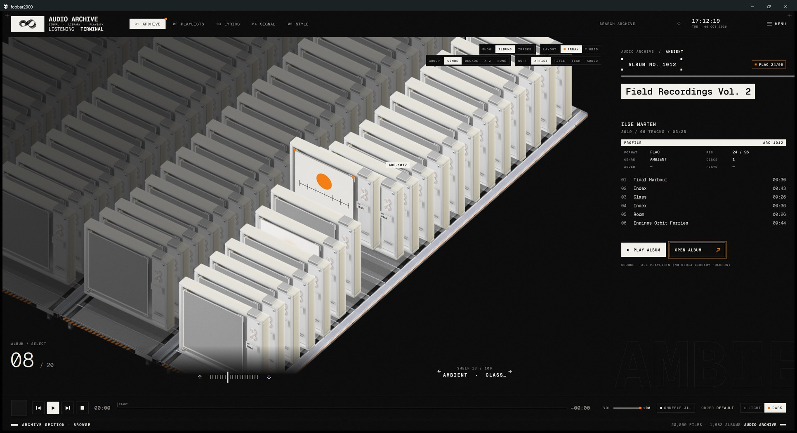

# RhinE — An Audio Archive

*A foobar2000 theme.*

**English** · [Installation Guide](INSTALL.md) · [ChangeLog (Or check out the Youtube Playlist)](CHANGELOG.md) 
 
[安装指南](安装指南.md) · [其他信息](其他信息.md) · [更新信息 (或查看BILIBILI分P)](CHANGELOG.md)

An archive terminal for listening: Swiss typography, a monochrome palette with one accent colour, and a sci-fi layer —
your albums as rendered specimen cases on shelves, a Möbius signal ring that pulses with the music, synced lyrics
(fetched online when your files have none), ten case skins and five colour schemes in light and dark. Windows,
foobar2000 v2 with Columns UI and JSplitter.

> **[Demo & Installation Guide & More](https://www.youtube.com/playlist?list=PLYhA3n8CTLnA&si=daRU0tDz3rFgFB_9)**

### preview

### Installation

**→ [INSTALL.md](INSTALL.md)** (中文：**[安装指南.md](安装指南.md)**). In short: download the portable bundle and
double-click `Setup 一键安装.cmd`, or download the theme and double-click `install.cmd`.

This page is about everything else. 其他信息的中文版：[其他信息.md](其他信息.md)。

What changed in each version: [CHANGELOG.md](CHANGELOG.md).

## What it is

Five views: **Archive** (every album, or every track, as a rendered specimen case on shelves, or a cover grid),
**Playlists** (playlist manager, track rail, the native playlist in two presets, a profile card with the queue),
**Lyrics** (synced lyrics from your files or fetched online, with a translation when they are in another language),
**Signal** (a rendered ∞ ring, spectrum and the whole-track waveform, or a Classic player screen) and **Style** (ten
case skins and five colour schemes, each in light and dark). A pre-rendered intro film, scan transitions, grain and a
Reduce motion option. The interface is in English, Simplified Chinese or Japanese.

## Requirements

- **Windows 10 or 11, 64-bit**
- **foobar2000 v2, 64-bit** (developed on v2.26 x64). The 32-bit build shows a black window, and the installer refuses it.
- **[Columns UI](https://github.com/reupen/columns_ui/releases)** 3.7 or later
- **[JSplitter](https://github.com/dima-lur/jsplitter/releases)** x64: tested with 3.9.4, 4.3.1 and 4.3.3. If the window
  stays black with *Error setting panel config* in the console, check that foobar2000 and JSplitter are both x64, then
  try JSplitter 3.9.4.

The installer installs the two components when they are missing (Columns UI 3.7.0 and JSplitter 3.9.4, from their
official GitHub releases, each checked against its SHA-256).

## What the installer does

`install.cmd` runs `install.ps1` (Windows PowerShell 5.1 or PowerShell 7). Nothing in your foobar2000 changes until
every check has passed. In order, it:

1. finds foobar2000: the standard install, or a portable one next to the theme folder. It asks when it finds several,
   and opens a folder picker when it finds none. `-Foobar "<folder>"` names it directly.
2. checks that this foobar2000 is v2 and 64-bit. If it is running, it offers to close it. If it has never run, it starts
   it once to create its configuration.
3. installs Columns UI and JSplitter if they are missing. It uses `.fb2k-component` files next to the installer or in
   `-ComponentDir`, and otherwise downloads them after asking. The x64 files go to
   `<profile>\user-components-x64\<component>\`.
4. backs up the configuration to `<profile>\audio-archive-backup\<date-time>\`;
5. copies the theme to `<profile>\themes\audio-archive\`;
6. installs the Geist Mono fonts for your Windows user only (no admin rights; `-NoFonts` skips this);
7. selects Columns UI as the user interface;
8. starts foobar2000 and imports the theme's layout (`-NoStart` skips this). If Columns UI has never run before, its
   one-time Quick setup dialog is closed so its presets do not replace the theme.

`-Yes` answers every question with yes. `<profile>` is `%APPDATA%\foobar2000-v2` for a standard install and
`<foobar2000 folder>\profile` for a portable one. The messages are in Chinese on a Chinese Windows.

**The portable bundle.** foobar2000's licence allows only its unmodified installer to be passed on. So the bundle carries
that installer, not a ready-made foobar2000. `Setup 一键安装.cmd` runs `setup\portable.ps1`, which does three things:

1. It unpacks the installer's files into `foobar2000\` with the bundled 7-Zip and marks the folder as portable. That is
   what the installer's own portable mode installs, with no registry entries, shortcuts or file associations, and no
   admin rights.
2. It runs `install.ps1` on that folder. Columns UI comes from the bundle (LGPL-3.0). JSplitter is downloaded from its
   GitHub release, because it comes with no licence that allows passing it on.
3. It adds the `RhinE (foobar2000)` shortcut.

Running it again keeps the foobar2000 folder and installs the theme again.

**By hand instead:**
1. Copy `js`, `tokens`, `columns` and `assets` to `<profile>\themes\audio-archive\`.
2. Install the fonts in `assets\fonts`.
3. Switch to Columns UI (*Preferences › Display › User interface module*).
4. Open *Preferences › Display › Columns UI › Import configuration…* and pick `columns\audio-archive.fcl`.

## Use

| | Mouse | Key (any of the theme's panels focused) |
|---|---|---|
| Archive / Playlists / Lyrics / Signal / Style view | click `01` – `05` in the header | `1` – `5` |
| Light / dark | `LIGHT` / `DARK` at the right of the transport | `T` |
| foobar2000's Preferences | `PREFERENCES` in the header (just the gear on narrow windows) | — |
| DSP: presets, equalizer, DSP Manager | `DSP` in the transport (it shows the active DSPs, or `OFF`) | — |
| Visualizations (foobar2000's own and those of installed components, each in its own window) | `VISUALIZATIONS` at the top right of the Signal view | — |
| Playlist preset: Album / Index | `LAYOUT` in the playlist head, or `MENU › Audio Archive` | `P` |
| Play / pause, previous, next, stop | the transport buttons | `Space` |
| Seek | click or drag the seek line; wheel over it = ±5 s | — |
| Volume | click or drag the volume line; wheel over it | — |
| Playback order | click `ORDER` | — |
| Shuffle the whole library | `SHUFFLE ALL` beside `ORDER`, or `ORDER › Shuffle entire library`, or `MENU` | `S` |
| Inspect the playing album (else the focused track's) | click the cover at the left of the transport, or the *Signal profile* card (Playlists and Lyrics views); right-click the cover to show the track in its playlist | — |
| Search | click `SEARCH ARCHIVE` and type: in the Archive it filters the albums in place (click the `FILTER` chip's × to clear), elsewhere it fills the *Search* playlist | `/`, then type; `Enter` now, `Esc` back |
| foobar2000's main menu | `MENU` (top right) | — |
| Reduce motion, grain | `MENU › Audio Archive › Reduce motion` / `Grain texture` | — |
| Playlists: switch | click a row in the playlist manager | `↑` `↓` (manager) |
| Playlists: new, rename, duplicate, remove | `+ NEW PLAYLIST`; double-click a row (or the name in the head) to rename; right-click a row | `Ctrl+N`, `F2`, `Delete` (manager) |
| Playlists: reorder | drag a row in the manager | — |
| Playlists: find a track | hover the track rail for its card; click to scroll there, double-click to play | — |
| Playlists: sort | click a column title in the playlist head (again: reversed; *Edit › Undo* restores) | — |
| Play from the queue | click a row under `QUEUE / NEXT` on the profile card (Playlists and Lyrics views) | — |
| Signal display: 3D ring, 2D ring or Classic | `MODEL 3D / 2D / CLASSIC` at the top right | `R` cycles (Signal view) |
| Seek ±5 s | click the signal trace to jump (Signal view) | `←` `→` (Lyrics and Signal views) |
| Lyrics: read ahead or back | the wheel over the lyrics; the view returns to the sung line 5 s later | — |
| Lyrics: play from a line | click the line | — |
| Lyrics translation: language, sources, keys | `MENU › Audio Archive › Translate lyrics` (see *Translated lyrics* below) | — |
| Intro film | `MENU › Audio Archive › Play intro film`, or `PLAY INTRO` in the Style view; switch it off at start there | `B` |
| Archive: add music | `+ ADD MUSIC FOLDER` while the Archive is empty (foobar2000's *Media Library* page) | — |
| Archive: album / row | hover and click a case; `↑` `↓` beside the album index; `←` `→` beside the row name; wheel | `↑` `↓` album, `←` `→` row, `PgUp` `PgDn` `Home` `End` (Archive) |
| Archive: inspect the album | click the selected case | `Enter`; `Esc` or click to return |
| Archive: play / open the album | `PLAY ALBUM` / `OPEN ALBUM` | `Space` plays (or pauses it if it is playing); `Enter` while inspecting opens |
| Archive: group by genre, decade, artist initial or none | `GROUP` in the Archive's top bar, or right-click | — |
| Archive: sort albums by artist, title, year or date added | `SORT` in the Archive's top bar, or right-click | — |
| Archive: next / previous shelf | `← SHELF 04 / 31 →` under the array | `←` `→` |
| Archive: every track as its own case / tile (with its album's cover) | `SHOW [ALBUMS | TRACKS]` in the Archive's top bar, or right-click | — |
| Archive: play a track | click it in the album file's track list (the album plays from there) | — |
| Archive: random pick (the selection runs through the shelves to a random album, which is lifted out and plays) | `RANDOM PICK` at the top left of the Archive, or right-click | `R` |
| Archive: titles on the cases' top edges | on by default; right-click › `Titles on the cases' top edges` | — |
| Archive: case array or cover grid | `LAYOUT ARRAY / GRID` at the top right of the Archive, or right-click | `G` |
| Archive grid: covers per page (10, 36, 50, 75, 100, 200) | `PER PAGE` in the grid's bar, or right-click | — |
| Archive: look again for covers of albums without artwork | right-click › `Re-index library` | — |
| Archive grid: select / play / open | click a cover / double-click / `OPEN ALBUM` | arrows, `PgUp` `PgDn` `Home` `End`; `Space` plays, `Enter` opens |
| Archive grid: scroll | the wheel, or drag the scroll bar at its right edge (a click on the bar jumps there) | `PgUp` `PgDn` |
| Case skin | `MENU › Audio Archive › Case skin`, or right-click the Archive | — |
| Colour scheme (ARCHIVE, HAZARD, FLARE, FIELD, COLD FRONT) | `MENU › Audio Archive › Colour scheme` | — |
| Style: see and switch skins and schemes | the `05 STYLE` view: hover a card for its preview, click to apply | `5` |
| Text size (90 – 150 %), Archive array scale (80 – 130 %), inspection size (100 – 150 %) | `TEXT`, `ARRAY` and `INSPECT` at the top of the `05 STYLE` view, or `MENU › Audio Archive › Text size` / `Archive array scale` / `Inspection size` | — |
| Archive floor: the page colour, a rendered lab deck under the shelves, or REAL STYLE (the Archive as one rendered scene on a walnut desk, always with the FROST case) | `FLOOR` at the top of the `05 STYLE` view, or `MENU › Audio Archive › Archive floor` | — |
| Interface language: English, 简体中文, 日本語 (default: Windows' display language) | `MENU › Audio Archive › Language · 语言 · 言語` | — |

The theme starts dark, with the ARCHIVE colour scheme and the WHITE case skin, in Windows' display language. Its
settings are kept in `<profile>\audio-archive-settings.json` as well as in the layout, so running a newer `install.cmd`
keeps them (from 1.2 on). Keys reach the theme when one of its scripted panels has keyboard focus (click an empty spot in
it first); the native playlist keeps foobar2000's own keys.

**Light and dark** are Columns UI's mode (*View › Mode*). The theme runs that command by its place in the menu, so it
also works in translated builds of foobar2000. If the colours still do not change, a message says where to switch the
mode. When the mode is *Use system setting*, Windows' own light / dark setting decides until you switch it in the theme.

## How the views work

**Playlists view.** The manager lists every playlist with a rail line as long as the log of its track count; the
active one is inverted, the playing one has an orange tab. The track rail beside the list shows one line per track
(a long playlist is spread over the lines, each standing for an equal share), and the hover card names the track
under the mouse. The head shows the playlist's number, name, size and state, switches the layout, and carries the
column titles. The profile card ends with what plays next: the playback queue, or the next tracks of the playlist.

**Lyrics view.** Lyrics come from an `.lrc` file next to the track (same name) or from a `LYRICS` / `SYNCEDLYRICS`
tag with time stamps; two lines with the same time stamp are shown as original and translation. When a track has
neither, the theme looks it up on [LRCLIB](https://lrclib.net), an open database of synced lyrics: it sends the
track's **artist, title, album and length** to lrclib.net and keeps what comes back in
`<profile>\audio-archive-cache\lyrics\` (it never writes next to your music or into its tags; a miss is not looked
up again for a week). Turn it off with `MENU › Audio Archive › Fetch lyrics online`. For more sources, the
[OpenLyrics](https://github.com/jacquesh/foo_openlyrics) component can save `.lrc` files or tags, which the theme reads.
Tracks without lyrics show a *NO LYRICS* pop-up. The read-outs and a live spectrum sit on the left, the profile card
with the queue on the right (the two columns mirror each other), and the line index beside the lyrics shows where you
are in the text. Long lines shrink to fit instead of being cut short.

**Translated lyrics.** When a track's lyrics are in one language and it is not yours, a translation can be shown under
each line (`MENU › Audio Archive › Translate lyrics`; the language follows Windows' display language until you pick
one):
- **Chinese: community translations, on by default when Windows is in Chinese.** The theme finds the song on
  [NetEase Cloud Music](https://music.163.com) (it sends the track's **artist, title and length**) and shows the
  translation its listeners wrote and timed. When a track has no lyrics on LRCLIB either, NetEase's lyrics are used.
  This uses NetEase's public web endpoints, not an official API, so it can stop working without notice.
- **Machine translation, off by default**, for when there is no community translation: MyMemory (free, no key, a daily
  quota), Baidu Translate (your own free APP ID and key; reachable from mainland China) or DeepL (your own key). Only the
  lyric lines are sent, only to the service you chose. Keys are kept in `<profile>\audio-archive-settings.json`
  on your computer.

Translations are kept in `<profile>\audio-archive-cache\lyrics\` too, so a song is looked up once. Chinese and other
CJK text uses Windows' own UI font (Geist Mono has no CJK).

**Signal view.** *CLASSIC* (beside the model switch) shows a familiar player screen instead, set out like a specimen
plate: the cover inside a dial of progress and segmented spectrum, the title and time under it, the current lyric on
a caption plate (else what plays next), the file's data and the up-next list in the margins, the frosted cover
behind. Otherwise graphics only: the ring, whose light pulses spawn on bass onsets and run faster with the music's energy
(they freeze while paused), a spectrum strip and the whole-track signal trace, which is decoded once per track and
cached in `<profile>\audio-archive-cache\waveform\`. `VISUALIZATIONS` opens foobar2000's own visualizations, and those
of components you installed, in windows of their own.

**Archive view.** Every album of the media library is one case (or, with `SHOW TRACKS`, every track, with its album's
cover). An album is the tracks with the same album tag in the same folder (a `CD2` / `Disc 1` folder counts as its
parent), so tracks with guest artists stay together. The cases stand on shelves of 20: the groups (genre, decade,
artist initial or none) follow one another, so every shelf is full; `SORT` orders them by artist, title, year or date
added. Each shelf keeps its own selection. The file on the right lists the album's tracks: click one to play the album
from there. `LAYOUT GRID` shows the same albums as a cover grid. The library is read on a background thread and cached
in `<profile>\audio-archive-cache\library.db`, so the view appears at once on the next start and follows library
changes by itself; cover thumbnails are extracted once in the background and cached in
`<profile>\audio-archive-cache\covers\`. Without media library folders the Archive shows the contents of all
playlists instead (it says so under the buttons). `PLAY ALBUM` and `OPEN ALBUM` fill one playlist, *Archive · Album*,
which they reuse. **Case skins** change the look of the specimen cases (Archive and profile cards): the theme ships ten
(the `05 STYLE` view shows them all). The Archive keys work when the Archive has keyboard focus (click it once).

**Search** updates an autoplaylist called *Search* 300 ms after you stop typing: every word must appear in the title,
artist, album artist, album, genre or date. It searches foobar2000's **media library** (*Preferences › Media
Library*), so folders must be added there first. `Esc` clears the field and returns to the playlist you were on.

**Playlist presets.** *Album* groups tracks by album, with one group line (`ARTIST — ALBUM · DISC n` on the left, year,
format and track count on the right), disc track numbers and a running position. *Index* is a flat table with the
playlist position, artist, album and year on every row, for mixed playlists and search results. The playing track is
marked orange in both.

## Updates

From 1.3 on the theme updates itself:

- **Check.** The theme reads the latest version from this repository (`theme/update/latest.json`, from GitHub, else
  through [jsDelivr](https://www.jsdelivr.com), which mirrors GitHub and is usually reachable from mainland China). It
  checks at most once a day, a few seconds after foobar2000 starts. Nothing about you or your music is sent. Switch it
  off with `MENU › Audio Archive › Check for updates daily`; `Check for updates…` beside it checks at once.
- **Offer.** A newer version shows an orange `UPDATE` chip in the bottom bar. Its menu lists what is new and offers
  *Update now*, the release page, or *Skip this version*.
- **Update.** *Update now* runs `tools\update.ps1` in a console window:
  1. It reads the release's file list (`theme/update/files.json` at the release's tag): every file with its SHA-256.
  2. It copies the files that did not change from the installed theme and downloads the others from the repository at
     that tag (GitHub, else jsDelivr). Most updates change a few scripts, so a few hundred KB are downloaded. When most of
     the theme changed, or a download fails, it downloads the release zip instead.
  3. It checks every file against its SHA-256, then runs the new version's `install.ps1`. That closes foobar2000, backs
     up its configuration, replaces the theme and starts it again; your settings are kept.

The updater can also be run by hand: `powershell -ExecutionPolicy Bypass -File update.ps1 -Foobar "<folder>"`
(`-Full` downloads the whole zip). Versions before 1.3 have no updater: install 1.3 once by hand.

## Uninstall in detail

`uninstall.cmd` runs `uninstall.ps1`. It finds the foobar2000 that has the theme (or takes `-Foobar "<folder>"`) and asks
you to confirm. It then restores the configuration from before the theme was first installed, so settings changed since
then are reverted too. The current configuration is kept in the backup folder first. Finally it removes the theme
folder, its settings file and the fonts. `-KeepConfig` removes only the files; `-KeepFonts` leaves Geist Mono
installed. Columns UI and JSplitter stay installed.

## Troubleshooting

- **Black window, or one empty panel:** check that foobar2000 and JSplitter are both 64-bit; if it persists, switch to
  JSplitter 3.9.4. Then run `install.cmd` again so it imports the layout again.
- **PowerShell says scripts are blocked:** `install.cmd` runs the script with `-ExecutionPolicy Bypass`. If it is still
  blocked, run `Get-ChildItem -Recurse | Unblock-File` in the folder first.
- **The Archive is empty, or shows "all playlists":** no media library folder yet; click `+ ADD MUSIC FOLDER`.
- **Changed an album's cover but the theme still shows the old one:** delete `<profile>\audio-archive-cache\covers\` and
  restart; the covers are made again.
- **foobar2000 uses about 5 – 8 % of one CPU core while idle:** that is JSplitter's own cost of about 1 % per panel;
  the theme does not redraw while nothing moves.
- **Animations are not smooth:** turn on JSplitter's *Use high-resolution timers* in *Preferences › Advanced*
  (optional).

## Known limits

- The column titles in the playlist head follow the preset's column widths. If you resize columns by hand in
  Columns UI's settings, re-import the theme layout (or switch the preset twice) to line them up again.
- The window title bar is the system one.
- The text size applies to the theme's own panels. The native playlist keeps Columns UI's fonts (*Preferences ›
  Display › Columns UI › Colours and fonts*).
- Archive cover thumbnails are not refreshed when you change an album's artwork; delete
  `<profile>\audio-archive-cache\covers\` to rebuild them. The first start with a large library extracts every
  album's cover once in the background (≈ 30 s for 600 albums).
- Online lyrics come from LRCLIB, and from NetEase Cloud Music when that is on (Chinese users by default).
  Community translations exist only in Chinese; for other languages there is machine translation. Lyrics a lookup
  missed are not looked up again for a week (delete `<profile>\audio-archive-cache\lyrics\` to retry at once).
- The seek line shows only the `START` marker; chapter and cue markers are not read yet.
- The Lyrics view's warning panel appears for local files that are missing; other decode errors are not reported to
  scripts by foobar2000.
- Animations run at up to ≈ 64 fps with foobar2000's default timer. For steadier motion turn on JSplitter's *Use
  high-resolution timers* (*Preferences › Advanced*, JSplitter's *Performance* section; optional).
- JSplitter itself uses about 1 % of one CPU core per child panel while idle (measured with empty panels; the theme's
  own scripts add nothing while nothing moves but the clock). The theme has 8 child panels (Archive, Lyrics, Signal
  and Style share one; the playlist manager and the track rail share one), so foobar2000 idles at ≈ 5–8 % of a core.

## Credits and licence

The theme is MIT-licensed ([LICENSE](LICENSE)). [Geist Mono](https://github.com/vercel/geist-font) is under the SIL Open
Font License 1.1 (`assets/fonts/OFL.txt`). Built on [foobar2000](https://www.foobar2000.org),
[Columns UI](https://github.com/reupen/columns_ui) and [JSplitter](https://github.com/dima-lur/jsplitter); online
lyrics from [LRCLIB](https://lrclib.net). The portable bundle carries foobar2000's unmodified installer, Columns UI
(LGPL-3.0, its licence alongside) and [7-Zip](https://www.7-zip.org) (LGPL, its licence alongside). The 3D art was
rendered in [Blender](https://www.blender.org), partly with materials from third-party material libraries used under
their licences.

#### Special Thanks

- 路北路陈 (LuBeiLuChen) https://space.bilibili.com/40238601 | RhineLabUI project: https://github.com/LBEILC/RhineLabUI
- Ronald没有魔杖 (Ronald Has No Wand) https://space.bilibili.com/171289190 | RhineLabUI-Music-Demo project: https://github.com/RonaldDeng/Rhine-Music-Demo
- Original Arknights PV: 《明日方舟》特别映像 [莱茵生命：访问]: bilibili.com/video/BV1rr4y1b7sz/
