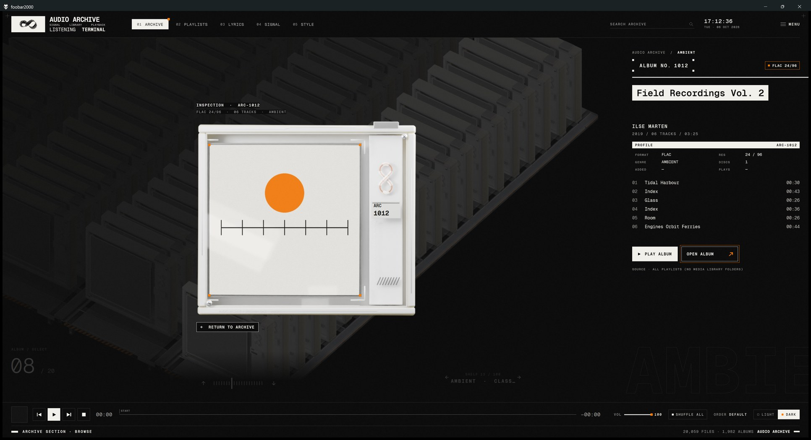
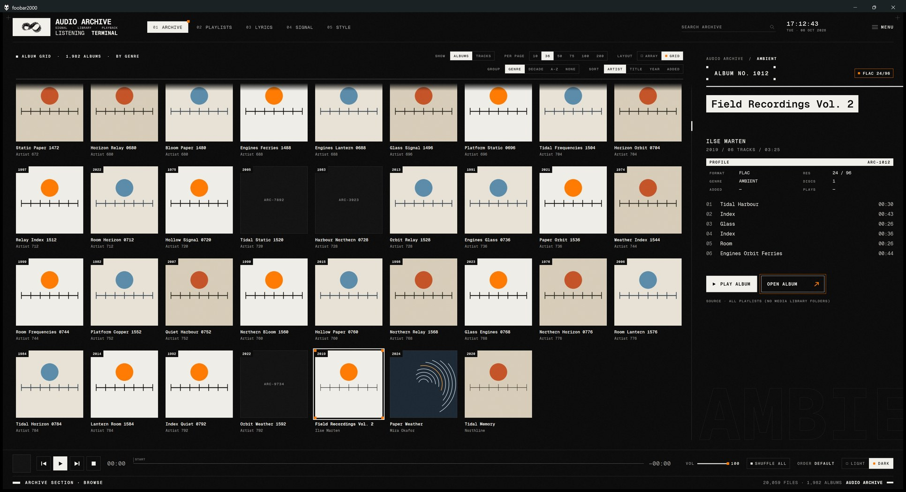
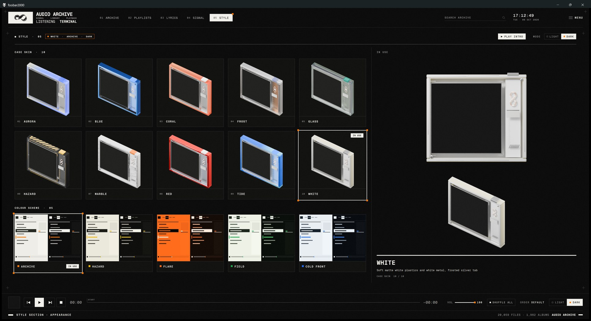
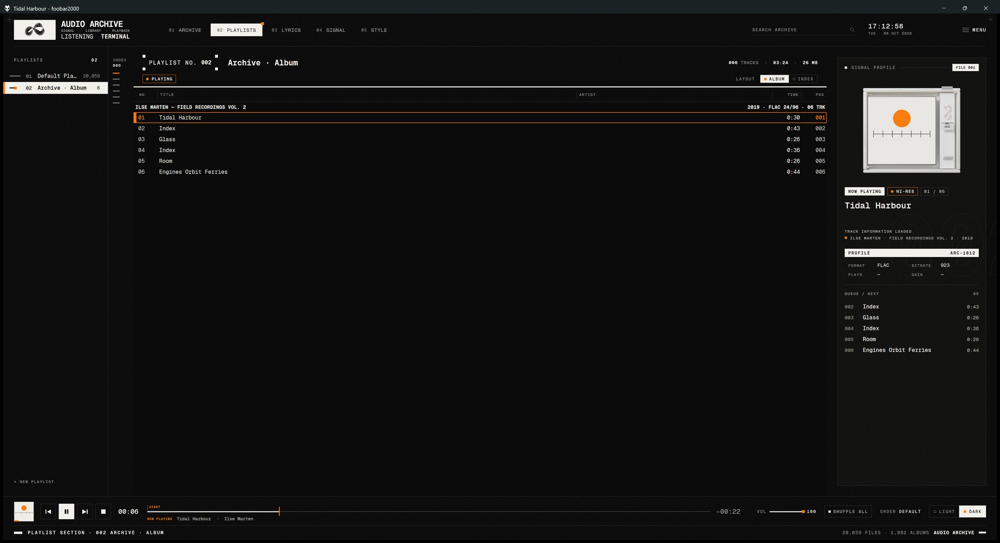
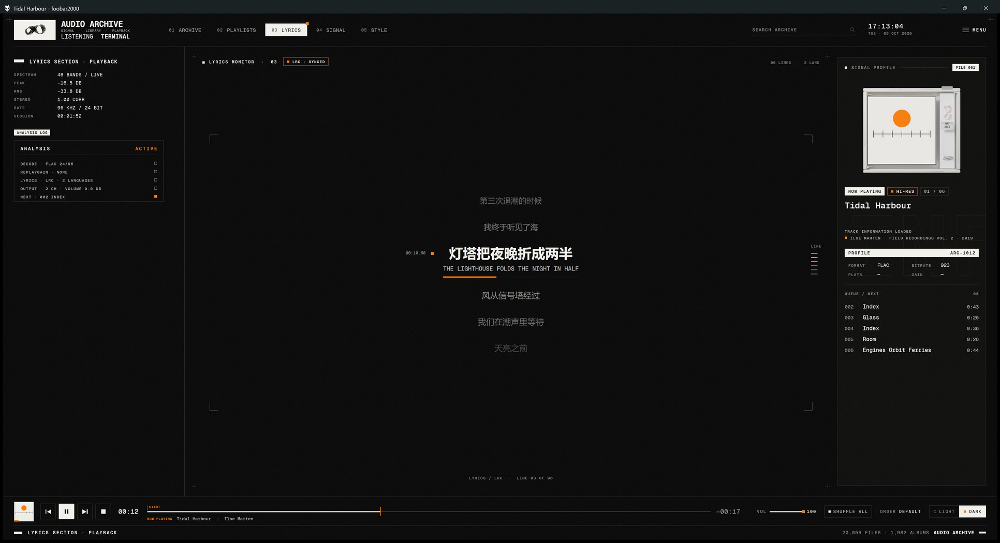
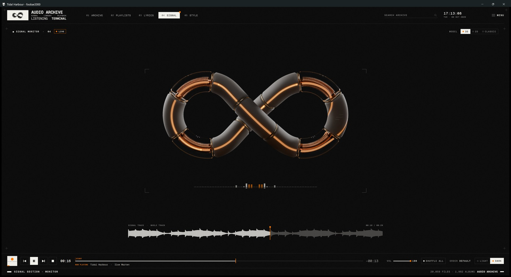
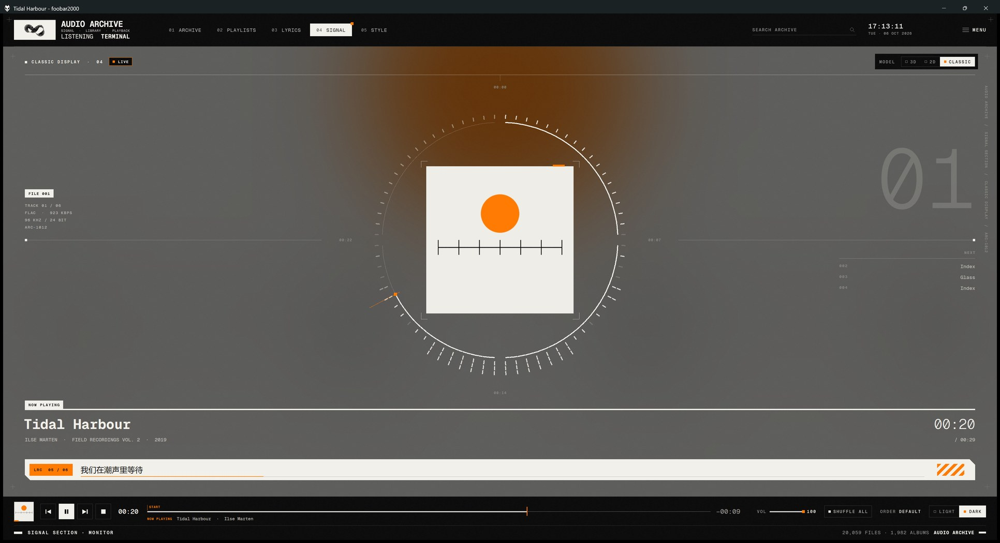
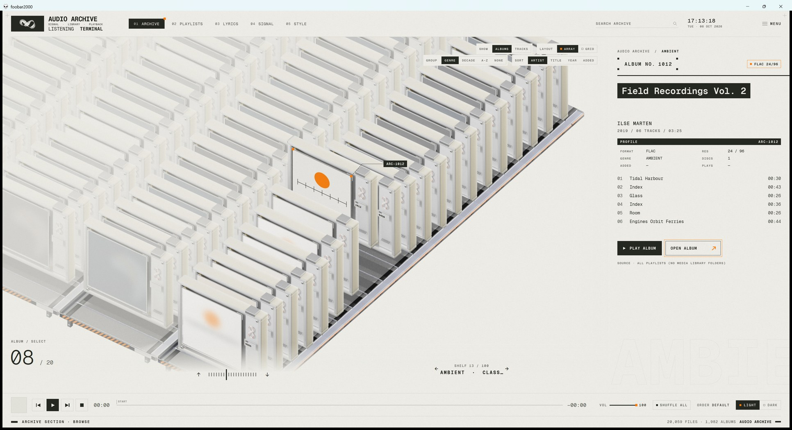

# Audio Archive — a foobar2000 theme

An archive terminal for listening: Swiss typography, a monochrome palette with one orange accent, and a sci-fi layer
(a Möbius signal ring, rendered album cases, profile cards). Windows only, light and dark.

**Version 1.0.** Five views: **Archive** (every album, or every track, as a rendered specimen case on shelves, or as a
cover grid), **Playlists** (playlist manager, track rail, the native playlist in two presets, profile card with the
queue), **Lyrics** (synced lyrics, from your files or fetched from LRCLIB), **Signal** (a rendered ∞ ring with live
pulses, spectrum and the whole-track signal trace, or a Classic player screen) and **Style** (ten case skins and five
colour schemes, each in light and dark). A pre-rendered intro film, scan transitions, grain and Reduce motion.


## Requirements

- **foobar2000 v2** (64-bit recommended; developed on v2.26 x64)
- **[Columns UI](https://github.com/reupen/columns_ui/releases)** 3.7 or later
- **[JSplitter](https://github.com/dima-lur/jsplitter/releases)** 3.9.4 x64 (tested). JSplitter 4.3.3 cannot read the
  layout's panel settings (*Error setting panel config* in the console, a black window): use 3.9.4.

Install both components the usual way (*Preferences › Components › Install…*, then restart foobar2000).

## Install

Download `audio-archive-<version>.zip` from the releases (or clone the repository and use the `theme` folder), unzip it,
close foobar2000, then run from that folder:

```powershell
powershell -ExecutionPolicy Bypass -File install.ps1 -Foobar "C:\Program Files\foobar2000"
```

`-Foobar` is the folder that contains `foobar2000.exe`; portable installs are detected. The script:

1. checks that this foobar2000 is v2, is closed, and has Columns UI and JSplitter;
2. backs up the configuration to `<profile>\audio-archive-backup\<date-time>\`;
3. copies the theme to `<profile>\themes\audio-archive\`;
4. installs the Geist Mono fonts for your Windows user only (no admin rights; `-NoFonts` skips this);
5. selects Columns UI as the user interface;
6. starts foobar2000 and imports the theme's layout (`-NoStart` skips this). If Columns UI has never run before, its
   one-time Quick setup dialog is closed automatically so its presets do not replace the theme.

**By hand instead:** copy `js`, `tokens`, `columns` and `assets` to `<profile>\themes\audio-archive\`, install the fonts in
`assets\fonts`, switch to Columns UI (*Preferences › Display › User interface module*), then
*Preferences › Display › Columns UI › Import configuration…* and pick `columns\audio-archive.fcl`.

`<profile>` is `%APPDATA%\foobar2000-v2` for a standard install and `<foobar2000 folder>\profile` for a portable one.

## Use

| | Mouse | Key (any of the theme's panels focused) |
|---|---|---|
| Archive / Playlists / Lyrics / Signal / Style view | click `01` – `05` in the header | `1` – `5` |
| Light / dark | `LIGHT` / `DARK` at the right of the transport | `T` |
| Playlist preset: Album / Index | `LAYOUT` in the playlist head, or `MENU › Audio Archive` | `P` |
| Play / pause, previous, next, stop | the transport buttons | `Space` |
| Seek | click or drag the seek line; wheel over it = ±5 s | — |
| Volume | click or drag the volume line; wheel over it | — |
| Playback order | click `ORDER` | — |
| Shuffle the whole library | `SHUFFLE ALL` beside `ORDER`, or `ORDER › Shuffle entire library`, or `MENU` | `S` |
| Show the playing track | click the cover at the left of the transport (Playlists view, track selected) | — |
| Search | click `SEARCH ARCHIVE` and type: in the Archive it filters the albums in place (click the `FILTER` chip's × to clear), elsewhere it fills the *Search* playlist | `/`, then type; `Enter` now, `Esc` back |
| foobar2000's main menu | `MENU` (top right) | — |
| Reduce motion, grain | `MENU › Audio Archive › Reduce motion` / `Grain texture` | — |
| Playlists: switch | click a row in the playlist manager | `↑` `↓` (manager) |
| Playlists: new, rename, duplicate, remove | `+ NEW PLAYLIST`; double-click a row (or the name in the head) to rename; right-click a row | `Ctrl+N`, `F2`, `Delete` (manager) |
| Playlists: reorder | drag a row in the manager | — |
| Playlists: find a track | hover the track rail for its card; click to scroll there, double-click to play | — |
| Playlists: sort | click a column title in the playlist head (again: reversed; *Edit › Undo* restores) | — |
| Play from the queue | click a row under `QUEUE / NEXT` on the profile card (Playlists and Lyrics views) | — |
| Signal display: 3D ring, 2D ring or Classic | `MODEL 3D / 2D / CLASSIC` at the top right | `R` cycles (Signal view) |
| Seek ±5 s | click the signal trace to jump (Signal view) | `←` `→` (Lyrics and Signal views) |
| Intro film | `MENU › Audio Archive › Play intro film`, or `PLAY INTRO` in the Style view; switch it off at start there | `B` |
| Archive: album / row | hover and click a case; `↑` `↓` beside the album index; `←` `→` beside the row name; wheel | `↑` `↓` album, `←` `→` row, `PgUp` `PgDn` `Home` `End` (Archive) |
| Archive: inspect the album | click the selected case | `Enter`; `Esc` or click to return |
| Archive: play / open the album | `PLAY ALBUM` / `OPEN ALBUM` | `Space` plays (or pauses it if it is playing); `Enter` while inspecting opens |
| Archive: group by genre, decade, artist initial or none | `GROUP` in the Archive's top bar, or right-click | — |
| Archive: sort albums by artist, title, year or date added | `SORT` in the Archive's top bar, or right-click | — |
| Archive: next / previous shelf | `← SHELF 04 / 31 →` under the array | `←` `→` |
| Archive: every track as its own case / tile (with its album's cover) | `SHOW [ALBUMS | TRACKS]` in the Archive's top bar, or right-click | — |
| Archive: play a track | click it in the album file's track list (the album plays from there) | — |
| Archive: case array or cover grid | `LAYOUT ARRAY / GRID` at the top right of the Archive, or right-click | `G` |
| Archive grid: covers per page (10, 36, 50, 75, 100, 200) | `PER PAGE` in the grid's bar, or right-click | — |
| Archive: look again for covers of albums without artwork | right-click › `Re-index library` | — |
| Archive grid: select / play / open | click a cover / double-click / `OPEN ALBUM` | arrows, `PgUp` `PgDn` `Home` `End`; `Space` plays, `Enter` opens |
| Archive grid: scroll | the wheel, or drag the scroll bar at its right edge (a click on the bar jumps there) | `PgUp` `PgDn` |
| Case skin | `MENU › Audio Archive › Case skin`, or right-click the Archive | — |
| Colour scheme (ARCHIVE, HAZARD, FLARE, FIELD, COLD FRONT) | `MENU › Audio Archive › Colour scheme` | — |
| Style: see and switch skins and schemes | the `05 STYLE` view: hover a card for its preview, click to apply | `5` |

The theme starts dark, with the ARCHIVE colour scheme and the WHITE case skin. Keys reach the theme when one of its scripted panels has keyboard
focus (click an empty spot in it first); the native playlist keeps foobar2000's own keys.

**Playlists view.** The manager lists every playlist with a rail line as long as the log of its track count; the
active one is inverted, the playing one has an orange tab. The track rail beside the list shows one line per track
(a long playlist is spread over the lines, each standing for an equal share), and the hover card names the track
under the mouse. The head shows the playlist's number, name, size and state, switches the layout, and carries the
column titles. The profile card ends with what plays next: the playback queue, or the next tracks of the playlist.

**Lyrics view.** Lyrics come from an `.lrc` file next to the track (same name) or from a `LYRICS` / `SYNCEDLYRICS`
tag with time stamps; two lines with the same time stamp are shown as original and translation. When a track has
neither, the theme looks it up on [LRCLIB](https://lrclib.net), an open database of synced lyrics: it sends the
track's **artist, title, album and length** to lrclib.net and keeps what comes back in
`<profile>\audio-archive-cache\lyrics\` (it never writes next to your music or into its tags; a miss is not looked
up again for a week). Turn it off with `MENU › Audio Archive › Fetch lyrics online`. For more sources, the
[OpenLyrics](https://github.com/jacquesh/foo_openlyrics) component can save `.lrc` files or tags, which the theme reads.
Tracks without lyrics show a *NO LYRICS* pop-up. The read-outs sit on the left, the profile card with the queue on the right, and the line
index beside the lyrics shows where you are in the text.

**Signal view.** *CLASSIC* (beside the model switch) shows a familiar player screen instead, set out like a specimen
plate: the cover inside a dial of progress and segmented spectrum, the title and time under it, the current lyric on
a caption plate (else what plays next), the file's data and the up-next list in the margins, the frosted cover
behind. Otherwise graphics only: the ring, whose light pulses spawn on bass onsets and run faster with the music's energy
(they freeze while paused), a spectrum strip and the whole-track signal trace, which is decoded once per track and
cached in `<profile>\audio-archive-cache\waveform\`.

**Archive view.** Every album of the media library is one case (or, with `SHOW TRACKS`, every track, with its album's
cover). An album is the tracks with the same album tag in the same folder (a `CD2` / `Disc 1` folder counts as its
parent), so tracks with guest artists stay together. The cases stand on shelves of 20: the groups (genre, decade,
artist initial or none) follow one another, so every shelf is full; `SORT` orders them by artist, title, year or date
added. Each shelf keeps its own selection. The file on the right lists the album's tracks: click one to play the album
from there. `LAYOUT GRID` shows the same albums as a cover grid. The library is read on a background thread and cached
in `<profile>\audio-archive-cache\library.db`, so the view appears at once on the next start and follows library
changes by itself; cover thumbnails are extracted once in the background and cached in
`<profile>\audio-archive-cache\covers\`. Without media library folders the Archive shows the contents of all
playlists instead (it says so under the buttons). `PLAY ALBUM` and `OPEN ALBUM` fill one playlist, *Archive · Album*,
which they reuse. **Case skins** change the look of the specimen cases (Archive and profile cards): the theme ships ten
(the `05 STYLE` view shows them all). The Archive keys work when the Archive has keyboard focus (click it once).

**Search** updates an autoplaylist called *Search* 300 ms after you stop typing: every word must appear in the title,
artist, album artist, album, genre or date. It searches foobar2000's **media library** (*Preferences › Media
Library*), so folders must be added there first. `Esc` clears the field and returns to the playlist you were on.

**Playlist presets.** *Album* groups tracks by album, with one group line (`ARTIST — ALBUM · DISC n` on the left, year,
format and track count on the right), disc track numbers and a running position. *Index* is a flat table with the
playlist position, artist, album and year on every row, for mixed playlists and search results. The playing track is
marked orange in both.

## Uninstall

Close foobar2000, then:

```powershell
powershell -ExecutionPolicy Bypass -File uninstall.ps1 -Foobar "C:\Program Files\foobar2000"
```

This restores the configuration from before the theme was first installed (so settings changed since then are reverted
too; the current configuration is kept in the backup folder first), removes the theme folder and the fonts.
`-KeepConfig` removes only the files; `-KeepFonts` leaves Geist Mono installed.

## Screenshots

| | |
|---|---|
|  Archive · shelves |  Archive · inspection |
|  Archive · cover grid |  Style · skins and schemes |
|  Playlists |  Lyrics |
|  Signal · 3D ring |  Signal · Classic |
|  Archive · light | |

Taken at 175 % display scaling with an invented test library (generated covers and tones).

## Known limits

- The column titles in the playlist head follow the preset's column widths. If you resize columns by hand in
  Columns UI's settings, re-import the theme layout (or switch the preset twice) to line them up again.
- The window title bar is the system one.
- Archive cover thumbnails are not refreshed when you change an album's artwork; delete
  `<profile>\audio-archive-cache\covers\` to rebuild them. The first start with a large library extracts every
  album's cover once in the background (≈ 30 s for 600 albums).
- Online lyrics come from LRCLIB only; its coverage of some languages is thin. Lyrics a lookup missed are not looked
  up again for a week (delete `<profile>\audio-archive-cache\lyrics\` to retry at once).
- The seek line shows only the `START` marker; chapter and cue markers are not read yet.
- The Lyrics view's warning panel appears for local files that are missing; other decode errors are not reported to
  scripts by foobar2000.
- Animations run at up to ≈ 64 fps with foobar2000's default timer. For steadier motion turn on JSplitter's *Use
  high-resolution timers* (*Preferences › Advanced*, JSplitter's *Performance* section; optional).
- JSplitter itself uses about 1 % of one CPU core per child panel while idle (measured with empty panels; the theme's
  own scripts add nothing while nothing moves but the clock). The theme has 8 child panels (Archive, Lyrics, Signal
  and Style share one; the playlist manager and the track rail share one), so foobar2000 idles at ≈ 5–8 % of a core.

## Credits and licence

The theme is MIT-licensed (`LICENSE`). [Geist Mono](https://github.com/vercel/geist-font) is under the SIL Open Font
License 1.1 (`assets/fonts/OFL.txt`). Built on [foobar2000](https://www.foobar2000.org),
[Columns UI](https://github.com/reupen/columns_ui) and [JSplitter](https://github.com/dima-lur/jsplitter); online
lyrics from [LRCLIB](https://lrclib.net). The 3D art was rendered in [Blender](https://www.blender.org), partly with
materials from third-party material libraries used under their licences.
